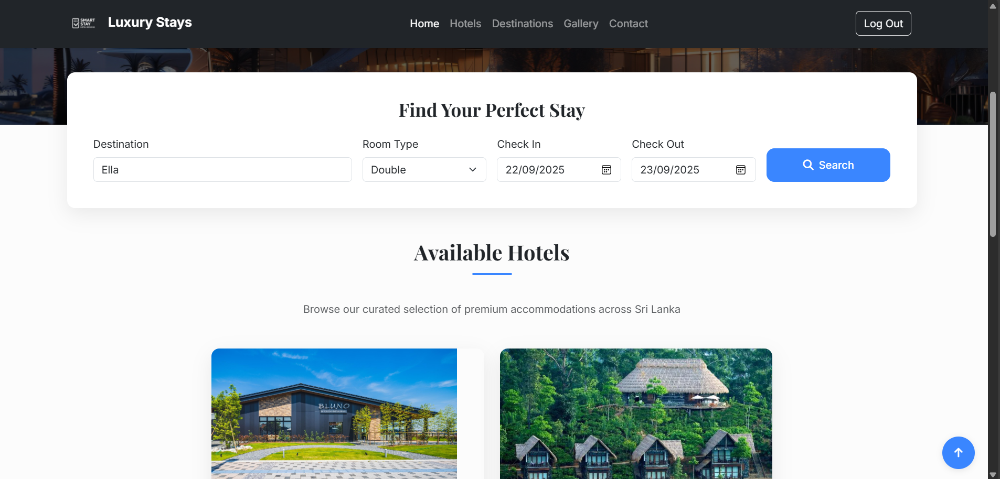
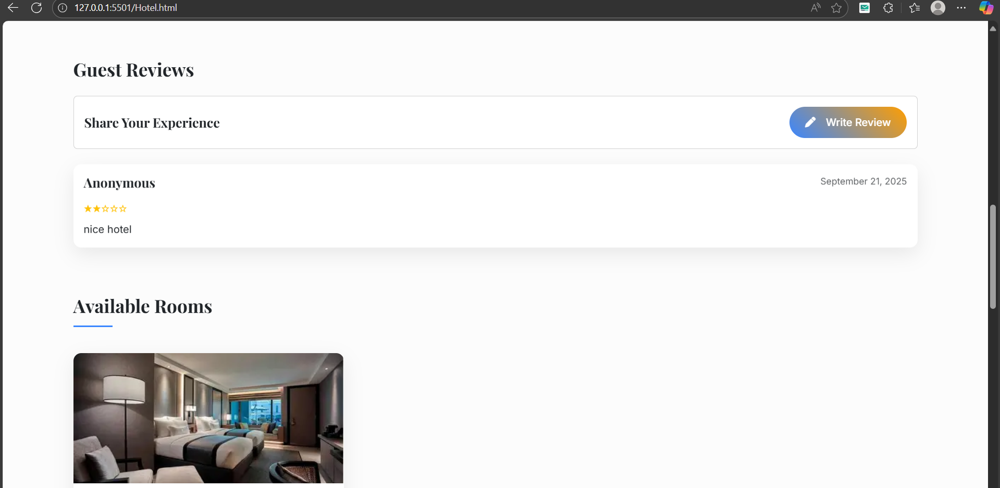
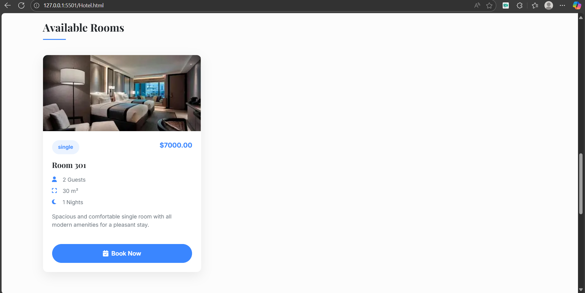
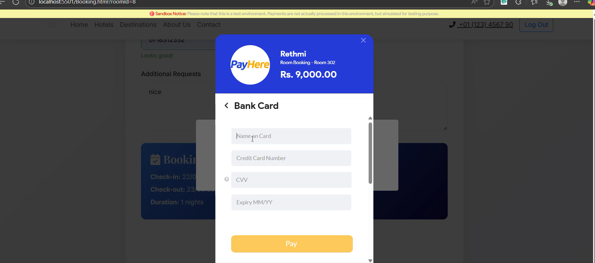
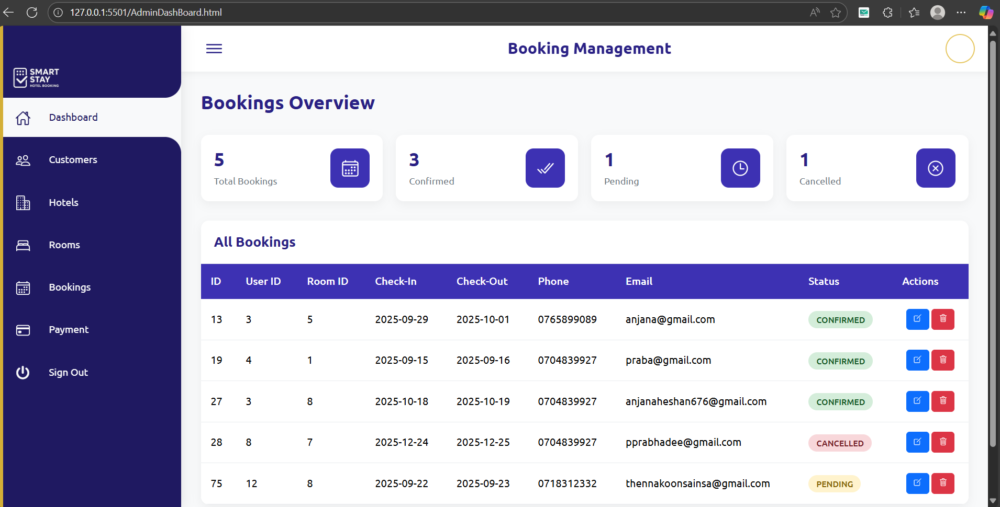
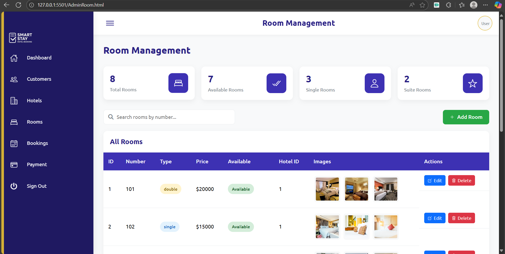
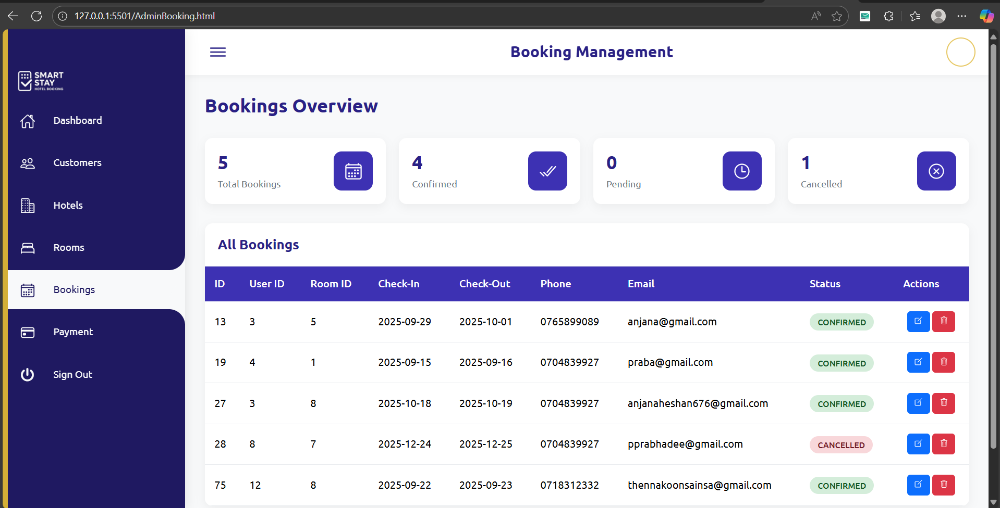

# 🏨 SmartStay - Hotel Management System
 
**A complete Hotel Management System built with Spring Boot to streamline hotel operations and enhance the guest booking experience.**
 
---
 
### 🎯 Key Objectives
- **Streamline Operations**: Automate hotel management tasks
- **Enhance Guest Experience**: Provide seamless booking and payment processes
- **Secure Transactions**: Implement robust authentication and payment security
- **Real-time Management**: Enable instant updates and notifications

---

## ✨ Key Features

### 🔐 **Authentication & Security**
- 🔑 User registration with email verification
- 🔒 Secure JWT-based authentication
- 📧 Password recovery via OTP
- 🛡️ Role-based access control

📸 Screenshots

🔑 Authentication


🏠 User Features

*Customer Dashboard*


*Home Page*


*Find Hotel*


*Chat Bot*


*Select Room*


*Select Hotel*


*Review*


*Available Room*


*Secure payment processing with PayHere integration*





*Report Invoice*


🛠 Moderation & Admin

### 👨‍💼 Admin Dashboard
*Comprehensive admin panel with intuitive navigation and real-time statistics*



### 🏨 Room Booking Interface
- ➕ Add new rooms with facilities
- ✏️ Edit room details and pricing
- 🗑️ Delete/deactivate rooms
- 📊 Room occupancy tracking
 


### 📊 Booking Management
**Reservation Control**
- 👀 View all bookings
- ✅ Confirm reservations
- 🔄 Update booking status
- ❌ Cancel reservations




### 🏨 Hotel Interface
- ➕ Add new hotels with facilities
- ✏️ Edit room details and pricing
- 🗑️ Delete/deactivate rooms


 
 

## 🚀 Installation & Setup Guide

### Prerequisites
Before you begin, ensure you have the following installed:
- ☕ **Java 21**
- 🛠️ **Maven 3.6+**
- 🗄️ **MySQL 8.0+**
- 🌐 **Modern web browser**

### Step-by-Step Setup

#### 1️⃣ Clone the Repository
```bash
git clone https://github.com/Rethmi/SmartStay_hotel_booking.git
cd SmartStay_hotel_booking
```

#### 2️⃣ Database Configuration
Create a MySQL database and update `application.properties`:
 
 

#### 3️⃣ Install Dependencies & Run
```bash
# Install Maven dependencies
mvn clean install

# Run the application
mvn spring-boot:run
```

#### 4️⃣ Access the Application
Open your web browser and navigate to:
```
http://localhost:8080
```

### 🔧 Configuration Notes

- **Default Admin Credentials**: Will be created on first run
- **PayHere Integration**: Requires merchant account setup
- **Email Service**: Configure SMTP settings for OTP functionality
- **File Uploads**: Cloudinary account needed for image storage

---
 

## 🎥 Demo Video

https://youtu.be/FBVwkdt5sZo
 
 
---
 
## 📞 Contact & Support
 
**Developer**: Sainsa Rethmi Thennakoon  
**GitHub**: https://github.com/Rethmi/SmartStay_hotel_booking.git
**Email**: reththennakoon.edu@example.com

---

### 🌟 Show Your Support
If you found this project helpful, please consider giving it a ⭐ star!

**Made with ❤️ using Spring Boot**

 